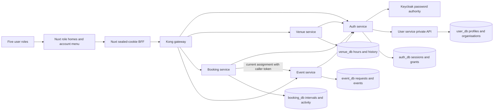
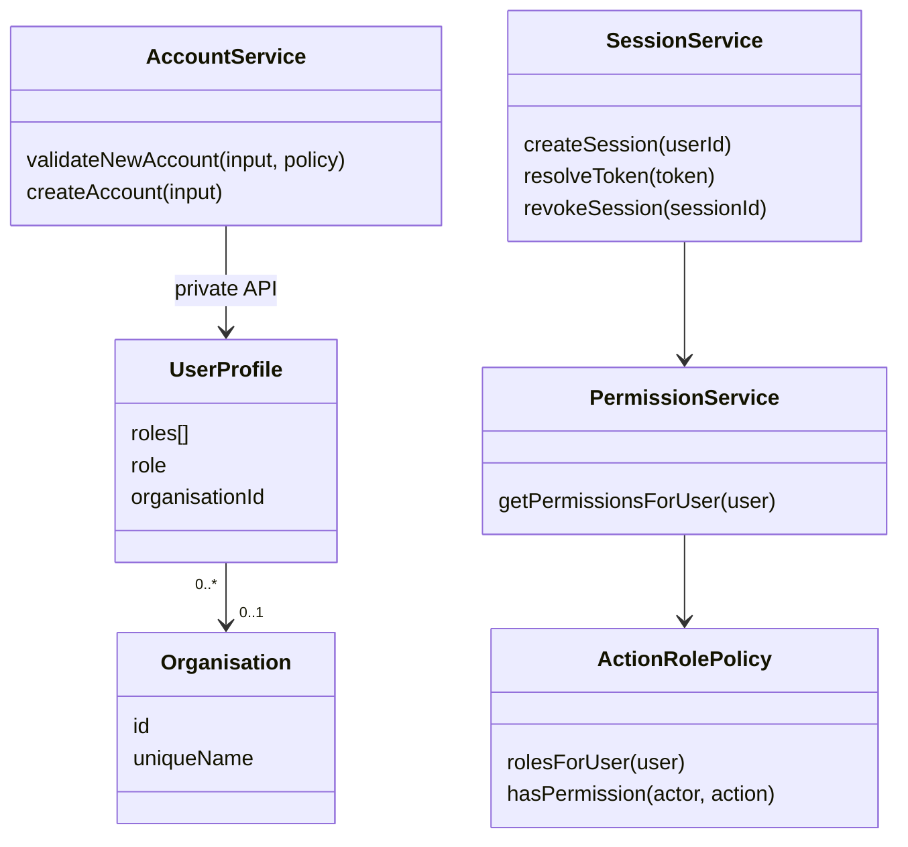
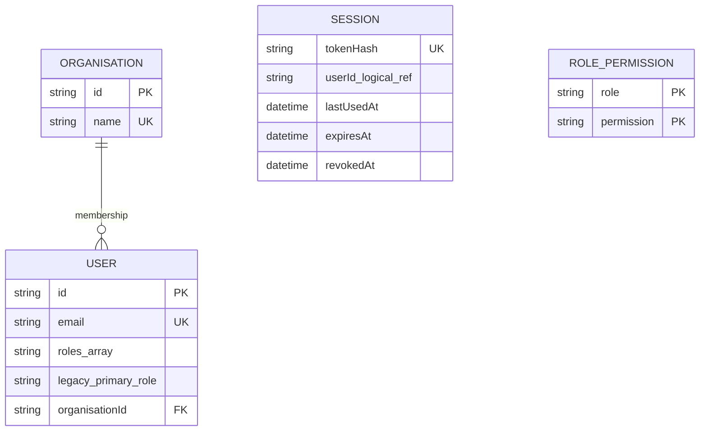

# ConnectSphere — microservices architecture (v0.1)

Architecture is current first draft, subjected to further changes along the way.

## Implemented identity and venue views — 7 October 2026

The diagrams below describe this branch and supersede the historical proposed layout for these components. Signup uses compensation across Keycloak/profile provisioning; no new generic saga service was introduced. Each API connects only to its own database. Static role policy is bundled in Auth/Venue/Booking images; cross-service identity still travels over private HTTP. Shared frontend role labels are a build-time utility in `frontend/lib/roles.ts`.







User/Organisation relations are within user_db; Session.userId is a logical reference in auth_db. Multi-role grants and organisation models already existed; the repair fills their runtime behavior. Only `venues.view` is added for Technical Support by a new migration. Venue operating-hour ordering adds validation without schema changes. The BFF-selected role lives in the sealed cookie and does not add a database field or an authority source.

## Historical proposed architecture

## The pattern

- **Kong** is the single entry point. It routes composite/multi-step
  requests to the **orchestrator-service** and plain CRUD/read requests
  directly to the owning domain service.
- **orchestrator-service** implements the *orchestration-based saga*
  pattern: it owns no domain data, only the state of each in-flight saga
  (`SagaInstance` / `SagaStep`), and drives each step by calling the
  relevant domain service's internal API over HTTP.
- **Every domain service owns exactly one bounded context and one
  database.** No service reads another service's tables directly, and no
  Prisma schema has a relation into another service's models — cross-service
  references are plain UUID fields, resolved by calling that service's API.
- **RabbitMQ is scoped to notifications only**: domain services publish
  events (e.g. `EVENT_CONFIRMED`) after a state change commits, and
  notification-service consumes them independently. This keeps the saga
  itself synchronous and easy to trace, while decoupling the
  "who do we need to notify" side-effect from the transaction.

## Services

| Service | Owns | Database |
|---|---|---|
| `user-service` | User, roles | `user_db` |
| `event-service` | EventRequest, Event | `event_db` |
| `venue-service` | Venue | `venue_db` |
| `booking-service` | VenueBookingRequest | `booking_db` |
| `attendance-service` | Attendance (RSVP) | `attendance_db` |
| `messaging-service` | MessageThread, Message | `messaging_db` |
| `notification-service` | Notification | `notification_db` |
| `orchestrator-service` | SagaInstance, SagaStep (own state only) | `orchestrator_db` |

All eight databases run inside a single local Postgres container for
convenience (`infra/postgres/init-databases.sh` creates them), but each
service only ever connects to its own — this is a deployment convenience,
not a hidden coupling. Splitting them onto separate Postgres instances
later is a one-line `DATABASE_URL` change per service, nothing more.

## Sagas owned by the orchestrator

1. **Event approval** — Coordinator decides on an `EventRequest`.
   `event-service` (mark approved, create `Event`) -> `notification-service`
   (notify the Organiser).
2. **Venue booking** — Coordinator requests a venue for an `Event`.
   `booking-service` (create request) -> `venue-service` (check
   availability) -> `event-service` (flag arrangement pending) ->
   `notification-service` (notify Venue Staff).
3. **Event confirmation** — Venue Staff approves the booking.
   `booking-service` (booking approved) -> `event-service` (mark confirmed)
   -> `notification-service` (notify Attendees).

Each saga gets one `SagaInstance` row keyed by a `correlationId` (the
originating request's ID), with one `SagaStep` row per downstream call —
this is what lets the orchestrator resume or compensate a saga that dies
partway through instead of leaving services in an inconsistent state.

## Repo layout

```
connectsphere/
├── apps/
│   └── web/                        # Vue 3 SPA — the only frontend for now
│
├── services/
│   ├── user-service/
│   │   ├── prisma/schema.prisma
│   │   ├── src/
│   │   ├── docs/openapi.yaml       # Swagger source for this service
│   │   ├── Dockerfile
│   │   └── package.json
│   ├── event-service/              # same shape as above
│   ├── venue-service/
│   ├── booking-service/
│   ├── attendance-service/
│   ├── messaging-service/
│   ├── notification-service/       # + RabbitMQ consumer
│   └── orchestrator-service/
│       ├── prisma/schema.prisma    # SagaInstance / SagaStep only
│       ├── src/
│       │   ├── sagas/              # one file per saga (event-approval.ts, ...)
│       │   └── clients/            # typed HTTP clients for each downstream service
│       ├── Dockerfile
│       └── package.json
│
├── gateway/
│   └── kong/
│       ├── kong.yml                # composite routes -> orchestrator, rest -> services
│       └── plugins/
│
├── infra/
│   ├── docker-compose.yml          # one postgres container (8 dbs), pgadmin, rabbitmq, kong, all services
│   └── postgres/init-databases.sh
│
├── e2e/playwright/                 # added later
│
├── docs/
│   ├── architecture.md             # this file
│   ├── requirements/               # ConnectSphere checklist, scoping docs
│   ├── sprint-backlog/
│   └── erd/                        # one ERD per service + a context map
```

Each `services/*` folder is a fully independent unit — own `package.json`,
own `Dockerfile`, own migrations. Nothing under `services/` imports from
another service's folder at runtime; the only things that can reasonably be
shared as versioned packages (not a shared runtime) are compile-time DTOs
or RabbitMQ event-contract types, if that gets unwieldy later.

## Open items to confirm once the docs are in hand

- Whether Attendee accounts are self-registered or invited by an Organiser.
- Whether a Venue can be booked for more than one Event concurrently.
- Whether the Message Thread feature is event-scoped only, or should also
  attach to a `VenueBookingRequest` — flagged earlier as a discrepancy
  between the Sprint Plan and the scoping doc.
- Whether any saga needs a genuine compensating action (e.g. releasing a
  venue hold if notification fails) or a retry is sufficient for this
  project's scope.

## Event-workflow branch update

The [changed-component sequence and ERD](event-workflows.md) describe the existing BFF/Kong/auth/event/PostgreSQL path, same transaction activity/outbox and request→Event linkage. The status guard remains shared. No new orchestration, notification or assignment service was added.
