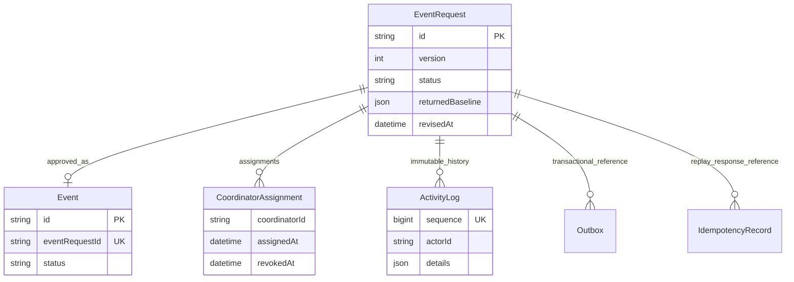

# Persistent event request workflows

CS-11, CS-29, CS-27 and CS-44 now use Alan's existing forms and Javier's event_db schema/transition guard. There is one persistent source. The old event Map/seed mock modules have been removed. Login defaults to live; explicit mock authentication exists only for tests and cannot satisfy event-service authentication. An unknown auth mode fails closed.

## Request path and transaction

```mermaid
sequenceDiagram
    participant UI as Existing Nuxt form
    participant BFF as Nuxt BFF
    participant Kong
    participant API as event-service
    participant Auth as auth-service / user-service
    participant DB as PostgreSQL event_db
    UI->>BFF: Fields + version + intent operationKey
    BFF->>Kong: Bearer session + Idempotency-Key
    Kong->>API: Forward request; strip caller identity headers
    API->>Auth: Validate live token and trusted roles/organisation
    API->>DB: Begin transaction; lock scoped replay key/current row
    API->>DB: Validate state/version; persist fields/status
    API->>Auth: Trusted Coordinator directory (initial submit only)
    API->>DB: Shared assignment + activity + outbox + replay response
    DB-->>API: Commit all or roll back all
    API-->>UI: Stable request ID, version/status/errors via BFF
```

`src/workflows.js` orchestrates these writes, calls the existing `decide`/`pickCoordinator`, and exports `recordActivity`/`recordOutbox` for other event transitions using **their existing Prisma transaction**. The activity writer allows captured fields, state and assignment changes; it never accepts arbitrary bodies/headers. Ordinary users have no history update/delete endpoint; the database append-only trigger enforces this too.

Draft validation permits missing mandatory fields. Full submission/resubmission uses the single `domain/validation.js` validator. Submitted/rejected requests are read-only. A returned request can be saved incomplete; a complete resubmit must differ from its return baseline. Baseline persists across intermediate saves. Revisions retain ID and Coordinator and record old/new values and revisedAt. No assignment reruns on resubmit.

An initial successful submit writes SUBMITTED plus a separate System COORDINATOR_ASSIGNED entry when a Coordinator exists. Drafts have only private create/edit activity. Decisions retain comments, actor and prior values. The owner sees the full immutable history. Current Coordinators cannot see Draft-only entries or old private Draft values on submission; those old values are explicitly marked private. Wider same-org Event viewers see only actual Event entries with the Event ID, not request/draft/amendment history. Visibility is filtered before pagination. History is newest-first, twenty per cursor page, ordered by a unique database sequence to disambiguate equal timestamps. A cursor must be a positive integer. Actor names are snapshots from trusted identity, with ID fallback; contact profiles/tokens are excluded. UI interpolation escapes all text.

## BFF mapping

| Browser endpoint | event-service via Kong | Meaning |
|---|---|---|
| POST `/api/events` | POST `/event-requests` | Existing form; saveAs submit by default, explicit draft |
| GET `/api/events` | GET `/event-requests` | Own request dashboard; Coordinator home gets queue separately |
| GET `/api/events/:id` | GET `/event-requests/:id` | Authorised current DTO |
| PUT `/api/events/:id` | PUT `/event-requests/:id`, or POST `/:id/submit` / `/:id/resubmit` | Plain save; submit:true; action:resubmit |
| POST `/api/events/:id/decision` | POST `/event-requests/:id/decision` | approve/reject/amendments adapted to shared APPROVE/REJECT/RETURN |
| GET `/api/review-queue` | GET `/event-requests/review-queue` | Current assigned submitted items and limited organiser contact |
| GET `/api/events/:id/activity` | GET `/event-requests/:id/activity` | Request history, including private Draft |
| GET `/api/event-history/:id` | GET `/events/:id/activity` | Actual Event ID; permits authorised same-org Organisers |
| GET `/api/events/:id/coordinator` | GET `/event-requests/:id/coordinator` | Relationship-scoped contact; no public user directory |
| GET `/api/events?scope=booking` | GET `/events` | Minimal actual Event options for existing booking UI |

Browser operationKey is stripped from body and forwarded as required Idempotency-Key. Foreign-origin cookie writes are rejected. Server-supplied identity/owner/status fields are not writable. Backend validation errors remain `{error:{code,message,fields:{field:[messages]}}}` inside the H3 error data envelope; 401/403/409/422 are preserved. A401 clears/revokes the sealed session. A503 keeps entered fields and never falls back to mocks. Intent keys remain stable for the same uncertain retry; edited input creates a new intent.

## Schema changes

Two forward migrations extend existing data: nullable local date/clocks and registration window; returned baseline/revision timestamp; scoped replay uniqueness; monotonic history sequence and request+sequence index; optional endDate for overnight round trips. The initial applied migration remains unchanged. Returned completeness is checked at resubmission, allowing incomplete intermediate amendments. Sequence backfill briefly disables the append-only trigger **inside the migration transaction**, then restores it; application writes cannot update old entries.



Outbox and IdempotencyRecord have logical references, not FK relations; the diagram names those references. The state guard remains the single source of transition rules. Request states are DRAFT→SUBMITTED→APPROVED or REJECTED, and SUBMITTED→RETURNED_FOR_AMENDMENT→SUBMITTED. Event ARRANGEMENT_PENDING displays Planning; request APPROVED alone is not a Confirmed Event.

See [decisions and pending acceptance](event-workflow-decisions.md), [access matrix](access-matrix.md), [isolated run recipe](event-review-run.md), and the executable [event OpenAPI](../services/event-service/docs/openapi.yaml).
