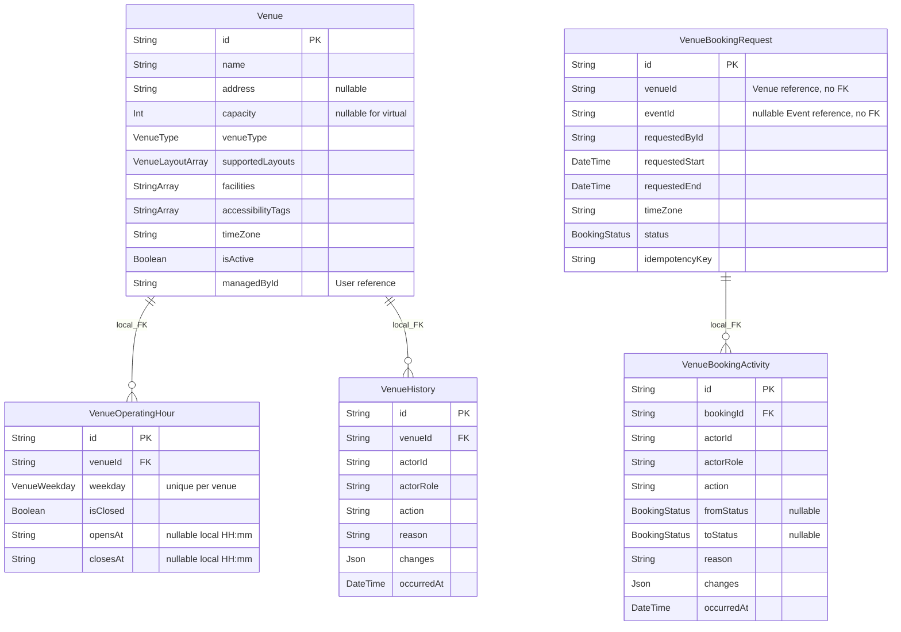

# Venue model: delivered baseline and Sprint 3 extensions

CS-74 review, 9 October 2026. The baseline is merged main `46a2bf3`.
The service schemas and migrations below define the running tables. The files
under `docs/erd` are historical logical drafts; they are not deployment schemas.
CS-77 owns the reviewed Week 7 extension contract. Another developer's review of
this baseline document is still required by CS-74.

## Authoritative sources

| Owner/database | Schema | Deployed migrations |
| --- | --- | --- |
| Venue / `venue_db` | [venue-service schema](../services/venue-service/prisma/schema.prisma) | [initial catalogue](../services/venue-service/prisma/migrations/20261003000000_init/migration.sql), [nullable virtual venue fields](../services/venue-service/prisma/migrations/20261004000000_virtual_venue_fields_nullable/migration.sql) |
| Booking / `booking_db` | [booking-service schema](../services/booking-service/prisma/schema.prisma) | [booking and activity ledger](../services/booking-service/prisma/migrations/20261003000000_init/migration.sql) |

IDs are generated UUID strings stored as PostgreSQL text. `venueId`, `eventId`,
`managedById` and actor IDs reference other services by value; there are no
cross-database foreign keys. Current Coordinator access is checked through Event
service. See the [access matrix](access-matrix.md) and [BFF mapping](frontend-bff-venue-booking.md).

The diagram abbreviates timestamp and status-change metadata; the linked schemas
contain every column. Foreign keys cascade only inside the owning database.

## Requirements versus implementation

Sources: Week 1 Customer Briefing, Venue Catalogue/Calendar/Unavailability;
Session 2 Clarification Answers_G8, worksheet rows 14–15, 21, 23–24 and 26–27;
current CS-33/34/35/74. Source documents remain in the shared project Drive.

| Requirement | Delivered baseline | Evidence / remaining boundary |
| --- | --- | --- |
| Catalogue location, capacity, layouts, facilities, accessibility and hours | Physical/virtual/hybrid; three layout enums; facility/accessibility string arrays; local weekly opening schedule | CS-33 component/HTTP/PostgreSQL checks. Physical/hybrid require positive capacity/address; virtual permits null. No numeric accessibility score was requested. |
| Auditable Venue Staff changes | Venue, hours and history are written in one Prisma transaction; updates require a reason | PostgreSQL TC-CS33-01/09/10 verifies persistence, failed-edit preservation and roles. Other internal readers cannot mutate. |
| Calendar tentative/confirmed/blocked/unavailable intervals | Booking statuses include `TENTATIVELY_HELD`, `CONFIRMED`, `BLOCKED`, `UNAVAILABLE`, plus available/rejected/cancelled; range filtering uses advertised instants | CS-34 tests prove local day/week, DST and interval rendering; PostgreSQL TC-CS34-07 proves an early local Monday record. |
| Operational block with reason and history | Venue Staff can create a `BLOCKED`/`UNAVAILABLE` booking row without a parent Event | HTTP contract checks plus PostgreSQL TC-CS35-01 persist the actor/reason and retrieve a block for a one-second overlap. Exact touching is omitted by the current half-open retrieval filter. |
| Prevent every incompatible overlap, even one second; first accepted competing request wins | No database exclusion constraint or per-venue write lock exists in the baseline | Retrieval is not write prevention. CS-39 must implement atomic conflict enforcement using the reviewed CS-85 window and hold rules. Do not infer this guarantee from the calendar. |
| Suitability: attendance/capacity, time, layout, accessibility and facilities | Fields exist for the comparison; catalogue text search currently checks name/address | Combined requirement-aware search and suitability are CS-36. Registration capacity/wait-list is a separate consumer, with a multi-room rule pending CS-76. |
| Tentative hold release and duration | Baseline stores tentative status and advertised start/end, with no expiry deadline | Session 2 allowed justified team duration choices; Week 7 now requires expiry. CS-37/90 add metadata and processing after CS-76/77 decisions. |

## Constraints and time handling

- `venue_operating_hours` has a unique `(venueId, weekday)` key. The API requires
  at least one row, valid weekdays, unique days, local `HH:mm`, and closing after
  opening for open days. Overnight schedules are rejected; closed days allow
  null opening/closing times. Creation and both edit routes return field errors
  without modifying the catalogue or its history.
- Venue arrays and positive capacity/hour ordering are enforced by the service.
  PostgreSQL does not have matching capacity/hour CHECK constraints; the array
  columns are nullable at the physical SQL layer. Direct SQL must not bypass
  the service contract. `timeZone` is a text column; catalogue validation only
  checks that it is non-empty, not that it is a valid IANA zone.
- Booking has a unique `(requestedById, idempotencyKey)` key, venue/time and
  venue/status indexes, and booking/time plus actor/time activity indexes.
  This prevents duplicate keys, not overlapping occupied windows. The existing
  read-before-write route is not proof of concurrent retry handling.
- Baseline `DateTime` columns deploy as `TIMESTAMP(3) WITHOUT TIME ZONE`.
  Service adapters normalize instants as UTC; the separate `timeZone` retains
  display intent. Opening hours remain venue-local clock strings. New timing
  helpers require an explicit UTC offset, valid calendar dates and at most
  millisecond precision; they do not change existing route validation.
- Deletion checks current/future tentative and confirmed bookings through a
  guarded Booking API and fails closed on upstream outage. There is no shared
  transaction between that check and deletion. It is not atomic booking conflict
  enforcement, nor does it count operational blocks as tentative bookings.

## Week 7 design boundary

The baseline has no persisted setup/turnaround, occupied-window revision,
deadline/version/extension history, booking warning/expiry outbox, or Safety
review model. It already permits multiple rows referring to one Event but
does not implement the complete independent multi-venue workflow/readiness gate.
The limited layout catalogue also differs from the broader examples in the
original brief; reconcile that scope in CS-76/77 before expanding enums.

[CS-84](https://spmg8.atlassian.net/browse/CS-84) owns buffer configuration;
[CS-85](https://spmg8.atlassian.net/browse/CS-85) owns its consistent window consumers;
[CS-39](https://spmg8.atlassian.net/browse/CS-39) owns atomic write conflicts;
[CS-37](https://spmg8.atlassian.net/browse/CS-37)/[CS-90](https://spmg8.atlassian.net/browse/CS-90)
own hold metadata/expiry; CS-87 and CS-93/94/95 own multi-venue and Safety flows.
The [policy register](venue-policy-decisions.md) and [expiry spike](hold-expiry.md)
prepare these changes without creating a competing production schema.

## Reproducible verification

9 October: Node 22.23.3, fresh PostgreSQL 16 with only isolated `venue_test`,
`booking_test` and `event_test` databases; all existing migrations deployed.
Venue unit 43/43, HTTP contracts 11/11, PostgreSQL HTTP 3/3. Booking unit 35/35,
HTTP contracts 14/14, PostgreSQL HTTP 6/6. Fresh SQL inspection confirmed the
physical columns/indexes above and zero leftover `cs78_*` scratch schemas.

Run from each Venue/Booking service directory with its matching disposable
`DATABASE_URL`: `npm ci`, `npx prisma generate`, `npx prisma migrate deploy`,
`npm run test:coverage`, `npm run test:contract`, `npm run test:integration`.
The [workflow](../.github/workflows/event-workflows.yml) repeats those commands and
archives logs. [DEVLOG](devlogs/DEVLOG.md) links the dated regression checkpoint.
Existing [Sprint 2 evidence](sprint2/evidence-log.md) retains earlier UI/restart
proof. This review publishes the model and findings; it does not close CS-74 or
claim the unfinished consumer stories are Done.
